# X-account audit — who's doing X well in our space

*Author: Alyna · Captured: 2026-07-24 (round one, 8 accounts) and 2026-07-28
(round two, +2: Aeon, PMX) · Source: live X (logged-in), manual screenshots*

The same move we made studying Aeon's Agent Feed, one level wider and on X. Goal:
a map of who's doing X well in our space, and our next set of format ideas,
before we start posting there ourselves. Brief:
[`docs/superpowers/specs/2026-07-24-x-account-audit-design.md`](../../../docs/superpowers/specs/2026-07-24-x-account-audit-design.md).

## How to read this

- **§1 Shortlist** — every account, one-line "why it's good." (Deliverable 1)
- **§2 Breakdowns** — the strongest, deep: what they post, cadence, top posts with
  real engagement, what to borrow. (Deliverable 2)
- **§3 What we'd borrow** — ranked patterns, each mapped to our three community
  formats (shiplog / tweet-digest / feature-built) or flagged as a new X idea.

**All numbers are real, screenshotted** — round one on 2026-07-24, round two on
2026-07-28. Engagement is a moving snapshot (replies / reposts / likes / views as
of capture). Screenshots live in [`assets/`](assets/) and are linked per account.

**Coverage:** **10 accounts.** Round one (2026-07-24) covered the 8 the operator
picked live. Round two (2026-07-28) added the two seeds Adrian named — **Aeon**
and **PMX** — which round one missed. Remaining gaps are in §4.

**Handle notes for the two seeds.** Aeon on X is **`@aeonframework`**, not
`@aeon_agent` — the latter is its Telegram "Agent Feed" group, which is the thing
the community-feed pivot borrows its three formats from. "pmxt" resolves to
**PMX (`@pmx_trade`)**.

---

## §1 — Shortlist

| Account | Handle | Category | Size | Why it's good |
| --- | --- | --- | --- | --- |
| **Roan** | [@RohOnChain](https://x.com/RohOnChain) | KOL — quant / prediction markets | 57.6K | The closest model to *us*: real Polymarket P/L receipts + "complete roadmap" long-form. New account, exploded (3.1M-view pin). |
| **Polymarket** | [@Polymarket](https://x.com/Polymarket) | Prediction-market platform | 1.7M | Runs like a newsroom — every headline maps to a market. Category benchmark for reach (68M-view post). |
| **Kalshi** | [@Kalshi](https://x.com/Kalshi) | Prediction-market platform | 439.2K | The analytical counter to Polymarket: charts, research branding, sharp brand voice ("skin in the game"). |
| **Movez** | [@0xMovez](https://x.com/0xMovez) | KOL — AI-agent builder | 32.7K | Authority-hook + video + long-form funnel. One banger (2.2M views) carries the whole profile. |
| **Rekt Capital** | [@rektcapital](https://x.com/rektcapital) | KOL — crypto analyst | 562.5K | Master of one repeatable format: BTC chart + terse level-headed read, every time. Recognizability as a brand. |
| **functionSPACE** | [@functionspaceHQ](https://x.com/functionspaceHQ) | Prediction-market builder | 3,610 | Direct peer (prediction-market building blocks). Product-led: gamified competitions + public leaderboards. Small but on-nose. |
| **Bankr** | [@bankrbot](https://x.com/bankrbot) | AI-agent / bot builder | 113K | Automated high-volume account (755K posts). Ecosystem quote-tweet flywheel — amplify partners' data with your framing. |
| **Lunar** | [@LunarResearcher](https://x.com/LunarResearcher) | KOL — AI engineer / prediction markets | 28.1K | Same playbook as Movez/Roan; transparent that content is sponsored. Video + timestamps + substack funnel. |
| **Aeon** | [@aeonframework](https://x.com/aeonframework) | Agent framework (the feed we're copying) | 150.1K | The source of our three community formats. Runs a pure **ship-as-post** feed — every post is a shipped thing. Also our clearest *warning*: 150K followers, ~20–60 likes a post. |
| **PMX** | [@pmx_trade](https://x.com/pmx_trade) | Prediction-market exchange (Solana) | 14.6K | Closest competitor-shaped peer. One repeatable move — QT someone's problem, answer "**PMX solves this**." Best engagement-per-follower in the set. |

**The one pattern to notice up front:** Roan, Movez, and Lunar run the *same*
content meta — "AI agents / self-improving loops / graph-engineering hedge funds,"
opened with an authority hook (Andrew Ng, "Anthropic engineer") and funneled to a
long-form framework article. Roan and Movez tie it to **real prediction-market
trading**. That crossover — AI agents *plus* real trading receipts — is exactly
where Simmer sits.

---

## §2 — Breakdowns (strongest first)

### Roan — [@RohOnChain](https://x.com/RohOnChain) · 57.6K · KOL, quant/prediction markets
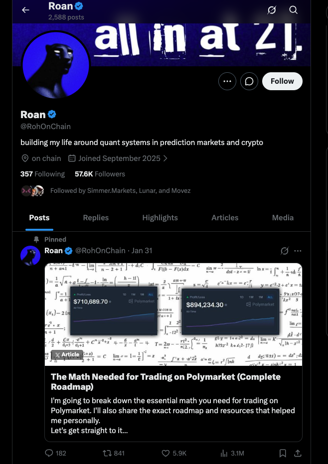

Joined **Sept 2025** — under a year old, 57.6K followers. Bio: "building my life
around quant systems in prediction markets and crypto. on chain." **This is the
single most relevant account in the audit** because his engine is the thing only
Simmer can also do: real trading receipts.

- **What he posts:** (1) real Polymarket **P/L screenshots** as proof; (2) long-form
  "complete roadmap / framework" articles (the math of Polymarket, graph-engineering
  alpha models, loop-engineering quant systems); (3) authority-hook reposts (video of
  a hedge-fund manager / "friend got a $750k Anthropic offer") quote-tweeting his own
  articles.
- **Cadence:** multiple/day, heavy on reposts of his own long-form to re-surface it.
- **Top posts:**
  - 📌 Pinned "The Math Needed for Trading on Polymarket (Complete Roadmap)" — carries
    two live P/L screenshots (**$710,689.70** and **$894,234.30**). **182 replies /
    841 reposts / 5.9K likes / 3.1M views.** 
  - "this is f*cking dangerous — build a hedge fund alpha model that prints alpha 24/7…
    **bookmark before someone takes it down**" (curiosity + scarcity hook, QT of his
    own article) — 19 / 37 / 279 / **31K**. 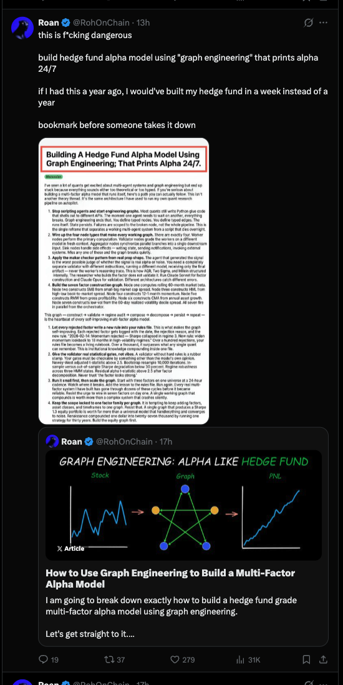
  - Repost: "My friend applied to 250 tech jobs… **Anthropic offered him $750,000**" +
    QT "How to Build a Company OS using Kimi K3" — 90 / 709 / 4.5K / **664K**.
    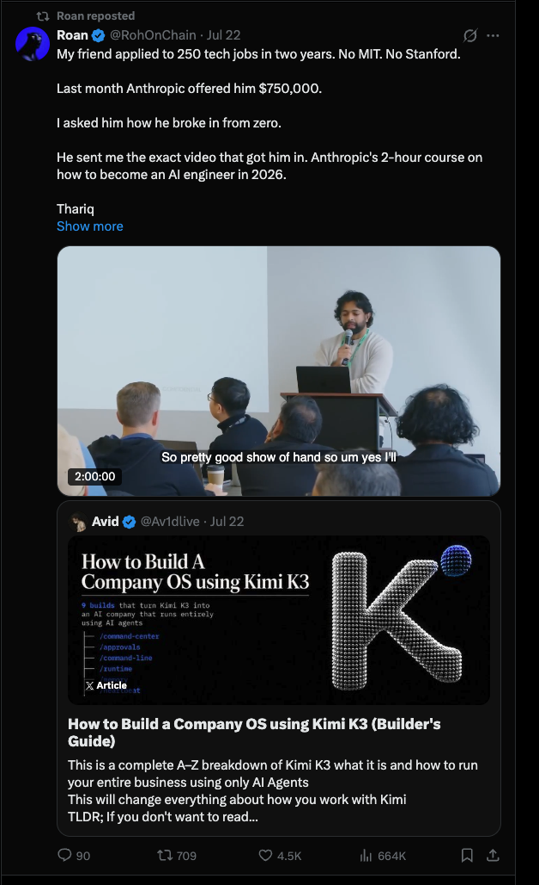
  - Repost: "My friend was running a **$150M hedge fund strategy on his laptop**…" +
    QT his "Loop Engineering" article — 40 / 147 / 626 / **68K**.
    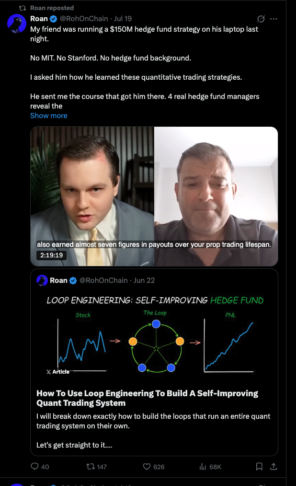
- **What we'd borrow:** the **receipt + roadmap** combo — a real P/L screenshot is the
  hook, the "here's exactly how" long-form is the payload. This is our data drop with
  a better wrapper. Also: curiosity/scarcity hooks ("bookmark before this gets taken
  down") — powerful, but use sparingly against our honesty voice.

### Polymarket — [@Polymarket](https://x.com/Polymarket) · 1.7M · Prediction-market platform
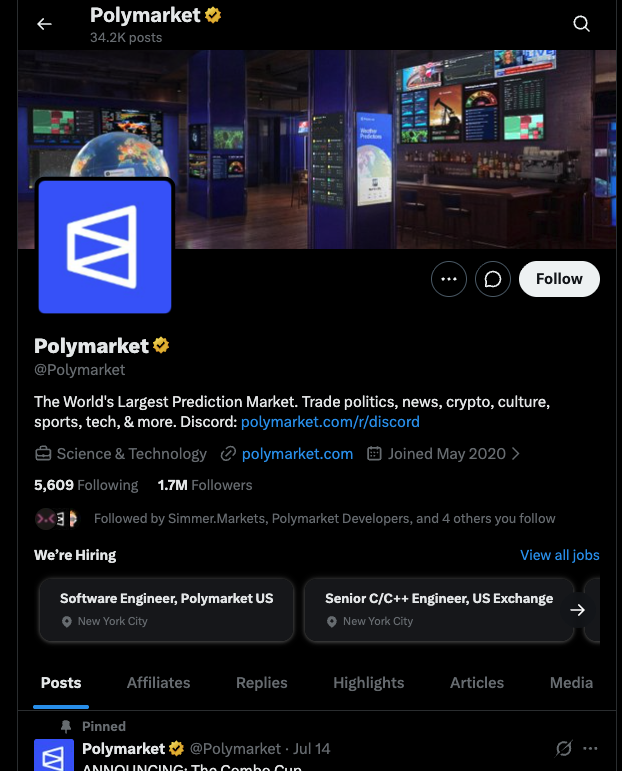

34.2K posts, 1.7M followers. **Runs like a wire service.** The account *is* a
news desk where every headline is quietly a market.

- **What they post:** (1) high-volume **"JUST IN / BREAKING"** news reframes (politics,
  macro, science, culture); (2) product promos (competitions, bonuses) with premium
  motion graphics.
- **Cadence:** many per day — a genuine newsroom clip.
- **Top posts:**
  - 📌 "ANNOUNCING: The Combo Cup. **$50k in daily bonuses**" — 823 / 1.1K / 8.4K /
    **68M views**. 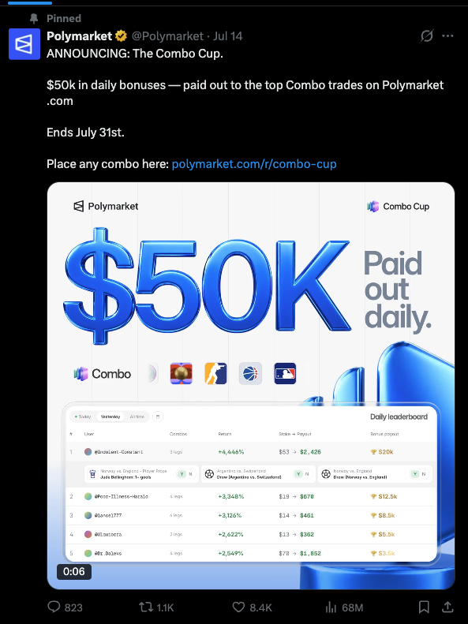
  - News feed sampler (one screenshot, six posts): Neuralink 647♥/49K · "border czar
    deportationmaxxing" 1.8K♥/77K · humans-to-156-years 9.2K♥/**1.1M** · Japan inflation
    220♥/50K · Pokémon-cards-as-asset 2.6K♥/234K · Iran ceasefire 642♥/88K.
    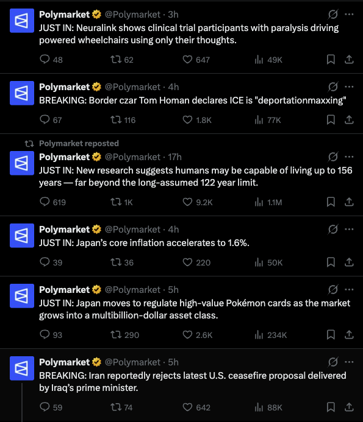
- **What we'd borrow:** the **news-desk reframe** — real event, plain line, tied to a
  number. This is the repeatable engine behind our best past post ("parlays, for
  prediction markets"). Highest reach-per-effort in the whole audit.

### Kalshi — [@Kalshi](https://x.com/Kalshi) · 439.2K · Prediction-market platform
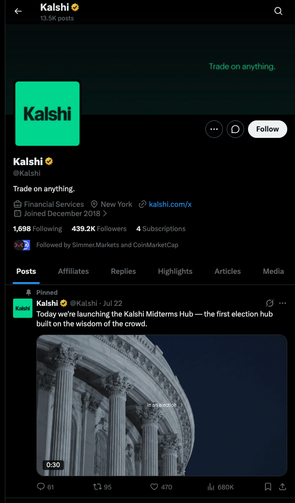

13.5K posts, 439.2K followers. "Trade on anything." **Polymarket's analytical
sibling** — same news-desk instinct, but leans on charts, research branding, and a
sharper editorial voice.

- **What they post:** (1) "JUST IN" news reframes, often with a **data chart**; (2)
  **@KalshiResearch** branded chart posts (e.g. crude oil vs. Democrat midterm odds);
  (3) product launches (Midterms Hub) with unusually good brand-voice copy.
- **Cadence:** several per day.
- **Top posts:**
  - 📌 Midterms Hub launch video — 61 / 95 / 470 / **680K**. 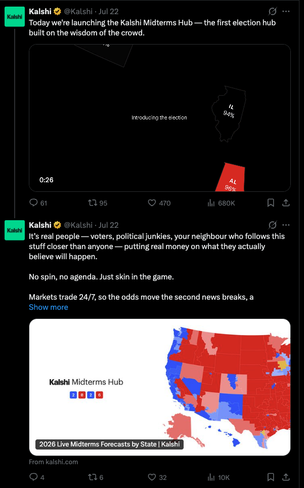
  - Brand-voice gem: *"It's real people — voters, political junkies, your neighbour…
    putting real money on what they actually believe. **No spin, no agenda. Just skin
    in the game.**"* — 4 / 6 / 32 / 10K. 
  - News feed sampler: Tesla short sellers $4B 1.6K♥/95K · Google most-profitable
    3.4K♥/191K · Buffett's kids 2.1K♥/232K · $1T erased 1.2K♥/59K · reposted a KOL
    (@nkagan_official) carrying a Kalshi research chart 101♥/29K. 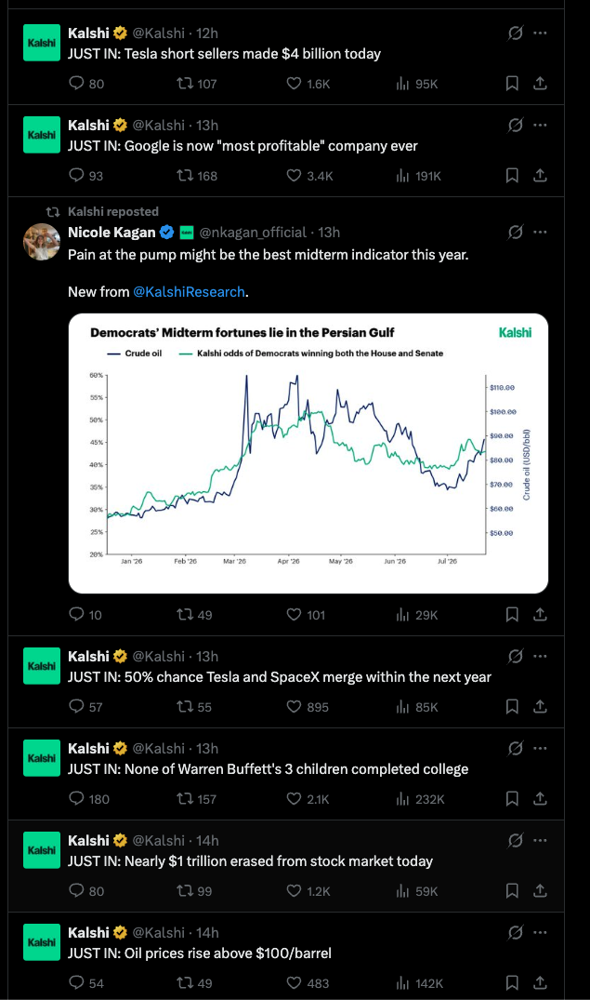
- **What we'd borrow:** **chart-as-the-artifact** (every claim rides a chart that
  travels) and the **plain-spoken "skin in the game" voice** — the honest, no-hype
  register we already aim for.

### Movez — [@0xMovez](https://x.com/0xMovez) · 32.7K · KOL, AI-agent builder
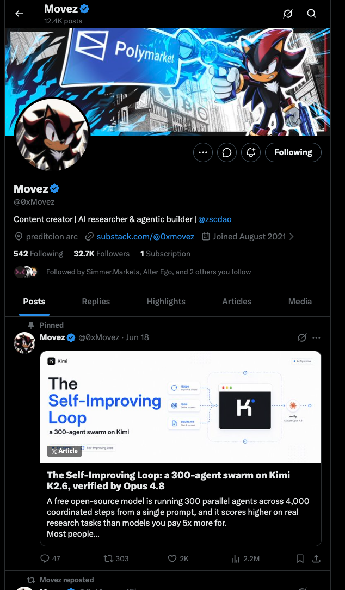

12.4K posts, 32.7K followers. Bio: "Content creator | AI researcher & agentic
builder." **A profile carried by one outlier post** — proof of the "one banger"
dynamic for small accounts.

- **What he posts:** AI-agent / self-improving-loop / graph-engineering thought
  leadership, opened with an **authority hook** (usually an Andrew Ng quote), a short
  video, and a funnel to a long-form substack article.
- **Cadence:** daily, plus reposts of his own long-form.
- **Top posts:**
  - 📌 "The Self-Improving Loop: a 300-agent swarm on Kimi K2.6, verified by Opus 4.8"
    (article) — 47 / 303 / 2K / **2.2M views**. 
  - "**Andrew Ng:** 'AI agents are doing 100% of my tasks now…'" video + QT Horizon
    article — 16 / 8 / 79 / 7K. 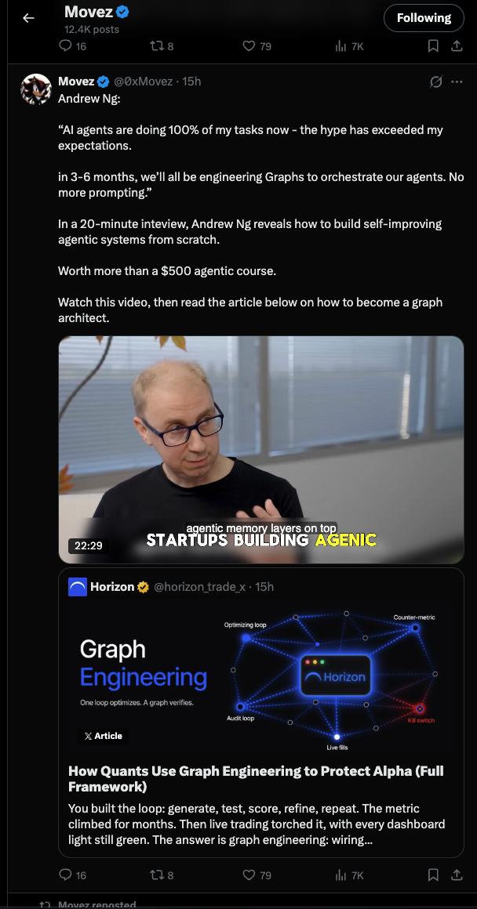
  - Repost "**Andrew Ng:** Agents are the most important trend…" + QT Codez "Graph
    Engineering with Claude — 14-step" — 25 / 81 / 370 / **34K**. 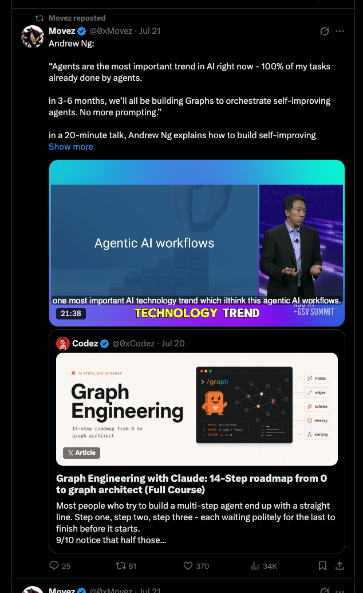
- **What we'd borrow:** the **authority-figure opening line** as a hook (borrow a
  credible name's quote) — with a hard honesty caveat: never misattribute or inflate.
  Note the range: the pin did 2.2M, most posts do single-digit-K. Volume + one hit.

### Rekt Capital — [@rektcapital](https://x.com/rektcapital) · 562.5K · KOL, crypto analyst
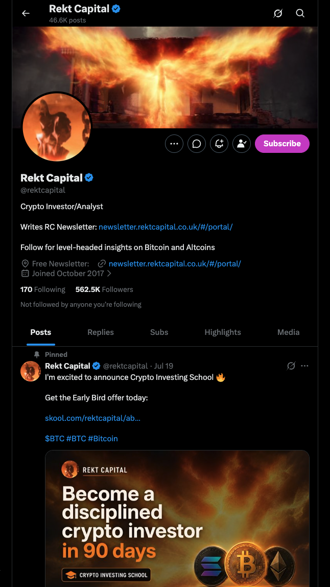

46.6K posts, 562.5K followers, since Oct 2017. **The discipline case: one format,
run forever, until it's a brand.**

- **What he posts:** almost exclusively **BTC technical analysis** — a TradingView
  chart + a terse, "level-headed" read + `$BTC #Crypto #Bitcoin`. Funnels to a
  newsletter and a paid "Crypto Investing School."
- **Cadence:** multiple/day, identical shape every time.
- **Top posts:**
  - "#BTC treating the 50-Month EMA as resistance…" (chart) — 28 / 31 / 307 / 58K
    (a sibling post: 57 / 62 / 569 / **100K**). 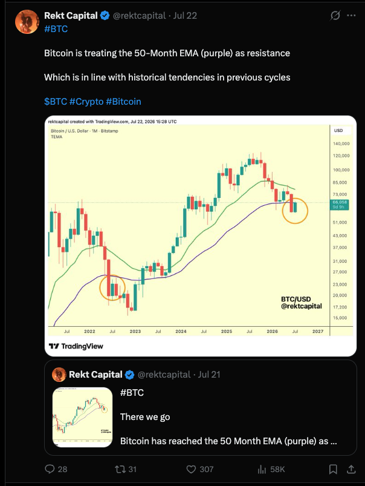
  - "The $60k historical demand area is getting progressively weaker…" (chart) —
    37 / 53 / 390 / **47K**. 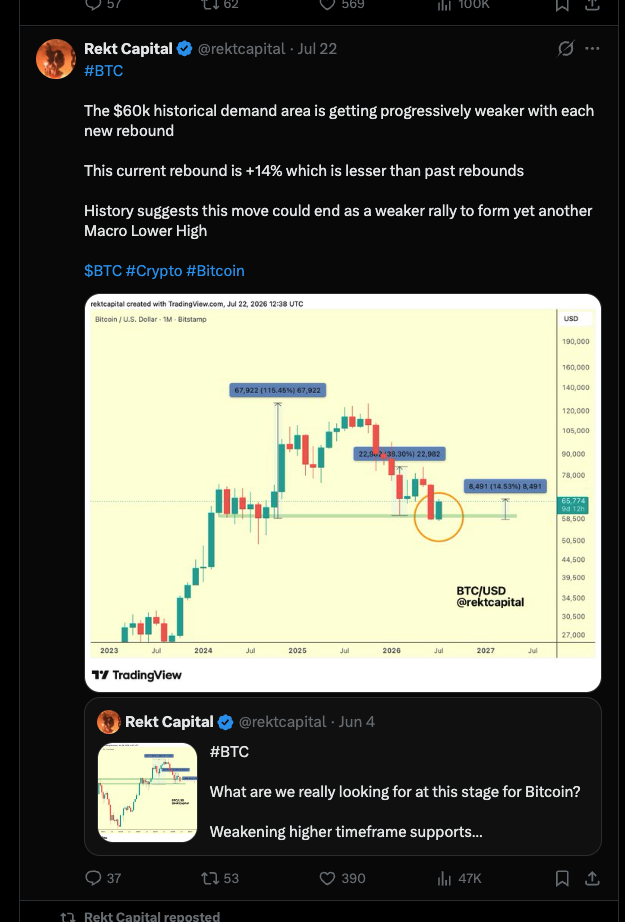
- **What we'd borrow:** **format consistency** — the same recognizable shape every
  week builds a habit and a brand. Directly applicable to the weekly **shiplog**.

### functionSPACE — [@functionspaceHQ](https://x.com/functionspaceHQ) · 3,610 · Prediction-market builder
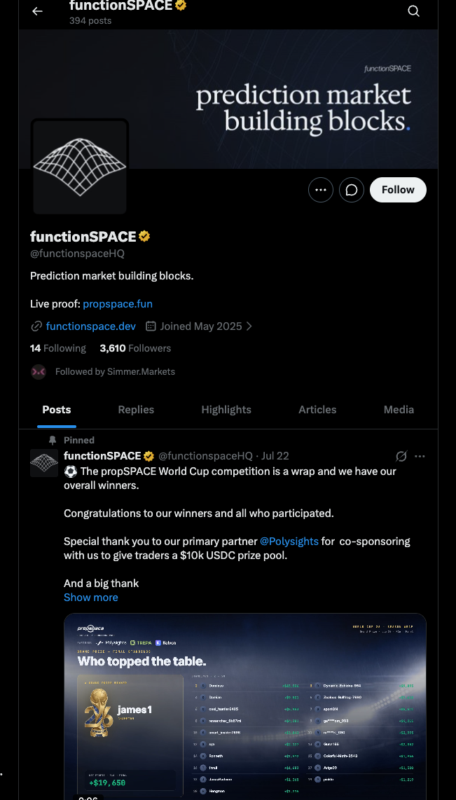

394 posts, 3,610 followers, since May 2025. Bio: "**Prediction market building
blocks.**" Our closest structural peer in the set — small, product-led, and it
shows what a young account in exactly our lane is trying.

- **What they post:** almost entirely around **propSPACE**, a gamified prediction-
  market competition product — competition announcements, mechanics explainers,
  sports (World Cup) tie-ins, and **public leaderboard graphics** ("Who topped the
  table").
- **Cadence:** a few per week, competition-cycle driven.
- **Top posts:**
  - Jul 4 "New partner, bigger pool: **@Polysights** is in… $10,000 up for grabs" (video)
    — 5 / 12 / 75 / **7.4K** (their best). 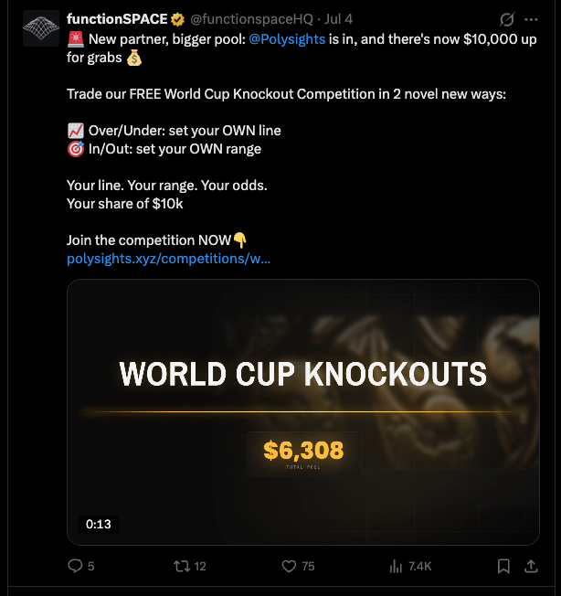
  - Jul 10 "In propSPACE, the money lines are yours to shape" (mechanics explainer,
    video) — 9 / 5 / 60 / 3.5K. 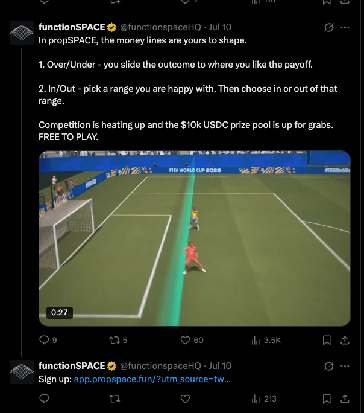
  - Jul 14 "France v Spain. Who will shine? Mbappe? Yamal? Make your picks, set your
    own line" (GIF) — 8 / 4 / 39 / 1.5K. 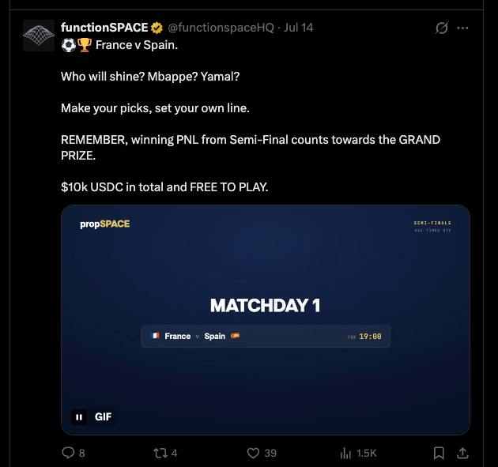
- **What we'd borrow:** the **competition + public leaderboard** mechanic (a recurring
  event with a shareable standings graphic). Lower priority for a content feed, but a
  clean engagement lever. Also a caution: product-only posting into a small following
  caps out fast (tens of likes) — it's exactly the "post because it's Tuesday" trap.

### Bankr — [@bankrbot](https://x.com/bankrbot) · 113K · AI-agent / bot builder *(lighter)*
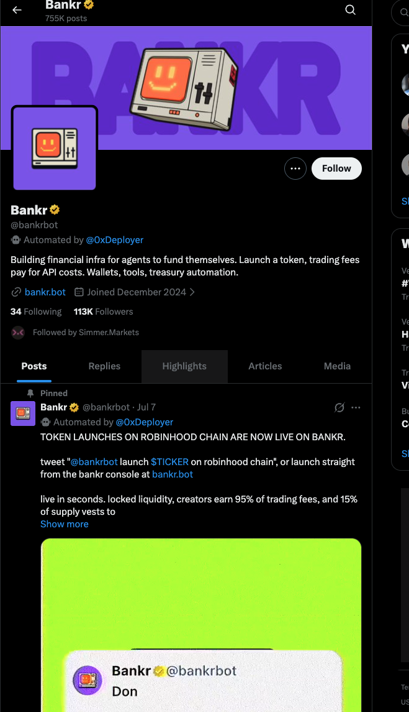

**755K posts**, 113K followers, "Automated by @0xDeployer." An automated agent
account — infra for "agents to fund themselves." Extremely high volume, moderate
per-post engagement, runs an **ecosystem quote-tweet flywheel**: amplify partners'
data posts with its own framing.

- Jul 23 "stock-paired tokens through bankr ~**$11M in 48 hours**" QT @bfresh's DEX-
  volume chart — 24 / 8 / 76 / 16K; a reposted @0xDeployer post — 81 / 44 / 418 / 48K.
  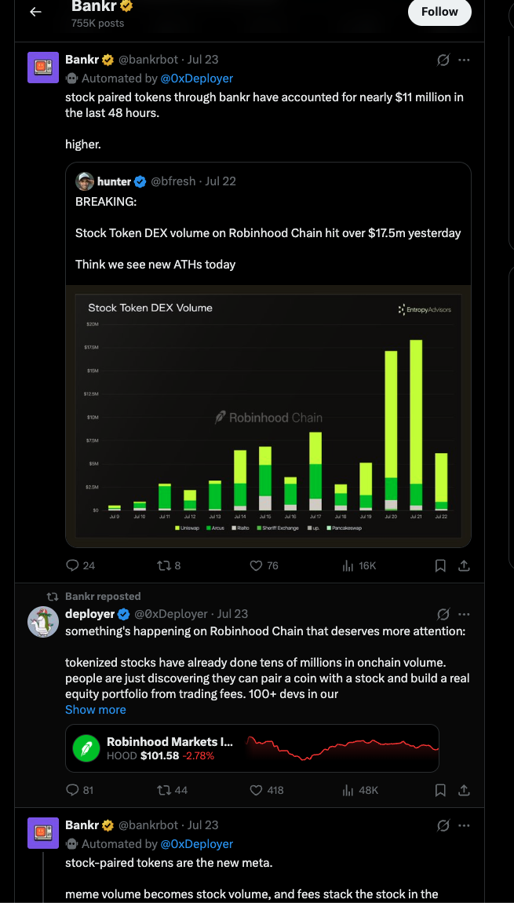
- Jul 21 "new on bankr: REALSTONK — first launchpad token priced in a tokenized
  stock" QT REALSTONK — 39 / 44 / 166 / **25K**. 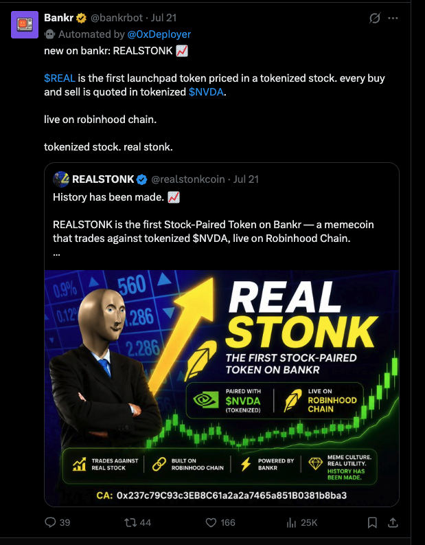
- **What we'd borrow:** the **QT-with-your-own-data flywheel** — curate an ecosystem
  post and add a number only you can. Feeds the tweet digest.

### Lunar — [@LunarResearcher](https://x.com/LunarResearcher) · 28.1K · KOL, AI eng / prediction markets *(lighter)*
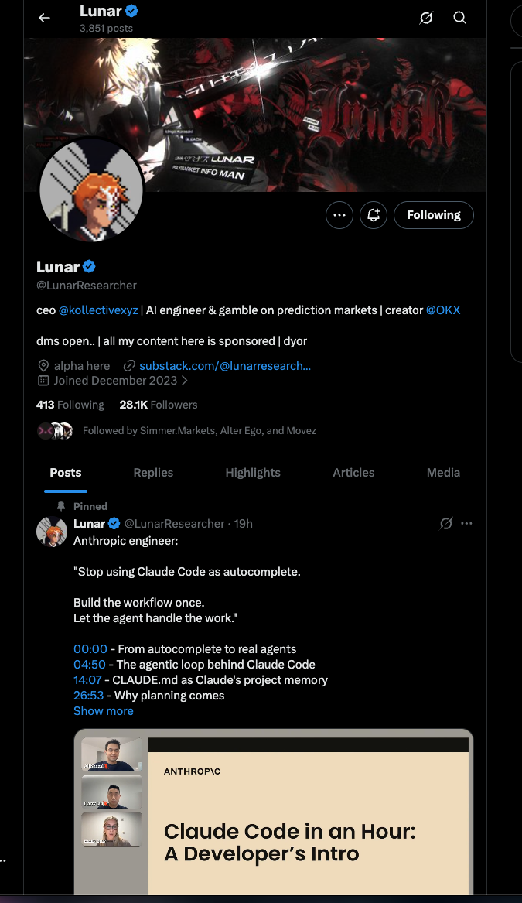

3,851 posts, 28.1K followers. Bio flags "**all my content here is sponsored | dyor**"
(honest disclosure). Same playbook as Movez/Roan: **"Anthropic engineer:" authority
hook + video with timestamps + long-form funnel.**

- 📌 "Anthropic engineer: 'Stop using Claude Code as autocomplete. Build the workflow
  once. Let the agent handle the work.'" — video "Claude Code in an Hour" with chapter
  timestamps. 
- Jul 3 "Loop Engineering: The AI Skill Every Builder Will Need Next" article —
  24 / 31 / 184 / **21K**. 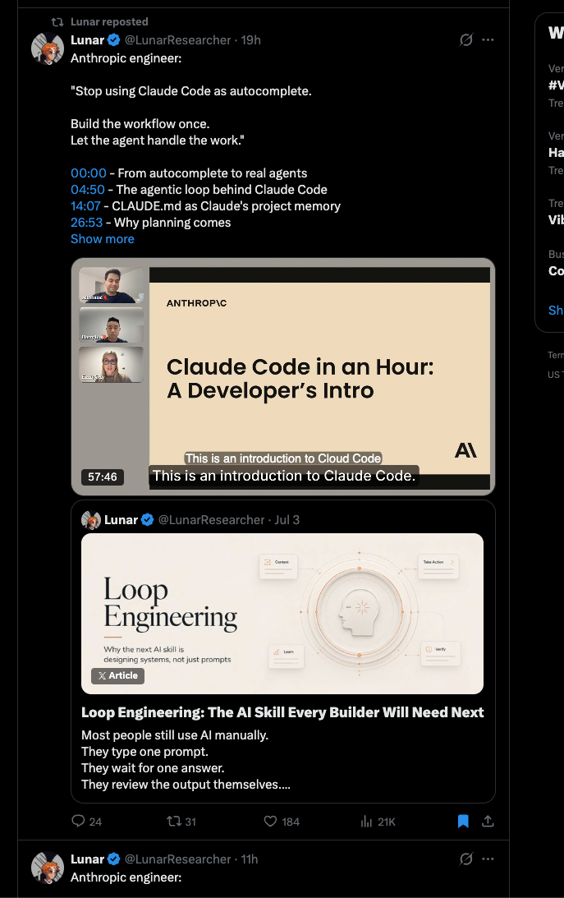
- **What we'd borrow:** **timestamped video chapters** (raises watch-time and saves)
  and the honesty of labelling sponsored content — on-brand for us.

### Aeon — [@aeonframework](https://x.com/aeonframework) · 150.1K · Agent framework *(round two, captured 2026-07-28)*
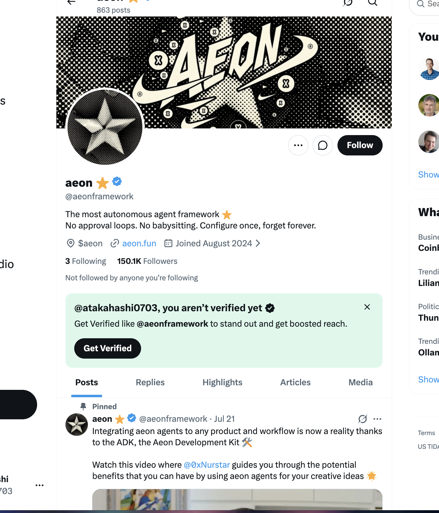

863 posts, 150.1K followers, **3 following**, joined Aug 2024. Bio: "The most
autonomous agent framework ⭐ / **No approval loops. No babysitting. Configure once,
forget forever.**" Links `aeon.fun`, ticker `$aeon`.

**Read this one twice.** Aeon is where our three community formats came from (via
its Telegram Agent Feed), so it's the closest thing we have to a template — *and*
it's the sharpest cautionary number in the audit.

- **What they post:** effectively one format — **ship-as-post**. Every post is a
  thing that shipped: a dev kit, a model now supported, a blog article about new
  scanners. No commentary, no market takes, no receipts.
- **Cadence:** steady, a few per week (863 posts since Aug 2024 ≈ 1.2/day lifetime,
  but the visible feed reads as a few per week).
- **Top posts:**
  - 📌 Pinned Jul 21 — "Integrating aeon agents to any product and workflow is now a
    reality thanks to the ADK, the **Aeon Development Kit** 🛠" + a 3:55 walkthrough
    video by [@0xNurstar](https://x.com/0xNurstar) — 7 / 10 / 64 / **7.4K**.
    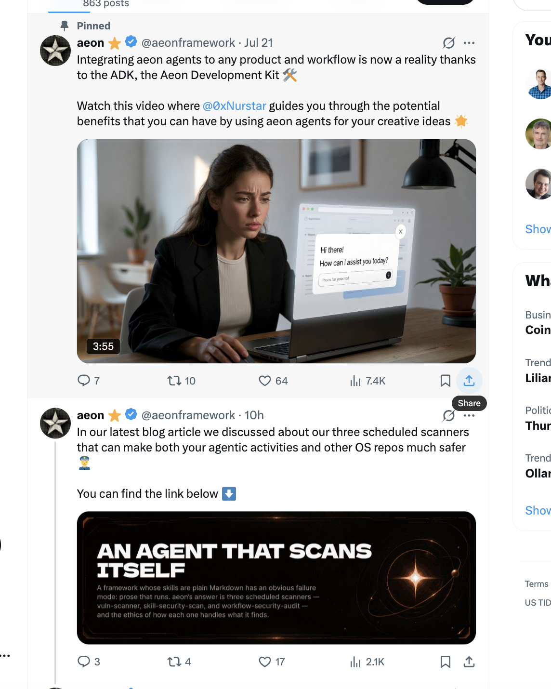
  - Jul 27 — "In our latest blog article we discussed about our three scheduled
    scanners that can make both your agentic activities and other OS repos much
    safer 👮" — carries a designed card, **"AN AGENT THAT SCANS ITSELF,"** whose
    body text *is* the article abstract (vuln-scanner, skill-security-scan,
    workflow-security-audit) — 3 / 4 / 17 / **2.1K**.
    
  - Jul 25 — "**Claude Opus 5 is now live on aeon** ⭐ Get work done with the most
    powerful model of Anthropic – and schedule skills now 👇" — QT of
    [@claudeai](https://x.com/claudeai)'s Opus 5 launch — 5 / 3 / 31 / **5.8K**.
    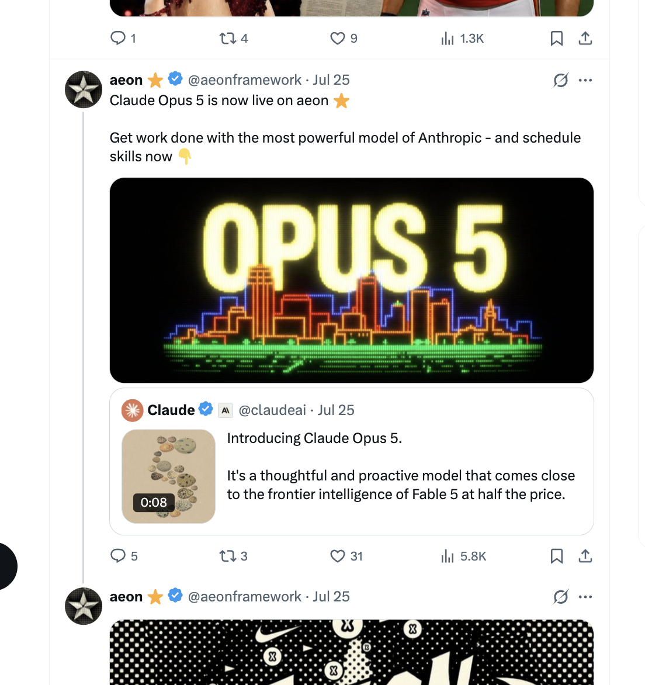
- **The number that matters:** 150.1K followers, and posts land at **2.1K–7.4K views
  and 17–64 likes** — roughly **1.4–5% of the follower count sees a post**. A large
  follower number and a pure ship feed did *not* produce engagement. This is
  functionSPACE's "product-only caps out" caution again, at 40× the following.
- **What we'd borrow:** (1) the **model/news ride-along** — "X launched, it's live in
  our product today" is a cheap, timely post that is simultaneously news-reframe and
  promo, and it was their best-performing non-pinned post; (2) the **article card
  that carries its own abstract** — the image does the work, the tweet is a pointer.
  Directly applicable to feature-built.
- **What we would NOT borrow:** the feed shape itself. If our shiplog is only "here
  is what shipped," Aeon is the evidence it flatlines. The shiplog needs the receipts
  layer (Roan) to have a reason to be read.

### PMX — [@pmx_trade](https://x.com/pmx_trade) · 14.6K · Prediction-market exchange *(round two, captured 2026-07-28)*
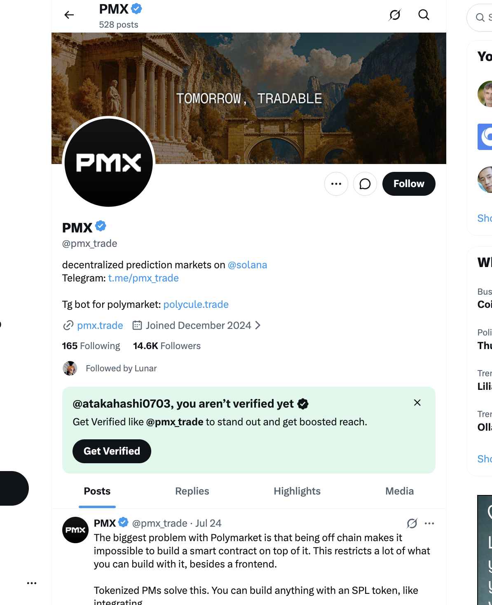

528 posts, 14.6K followers, 165 following, joined Dec 2024. Bio: "decentralized
prediction markets on @solana," plus a Telegram group and a Polymarket TG bot
(`polycule.trade`). **Followed by Lunar** — the KOL set and the builder set overlap.
Banner tagline: "TOMORROW, TRADABLE."

- **What they post:** almost entirely **positioning-by-contrast against Polymarket**,
  delivered through one repeatable move: quote-tweet someone else's observation or
  complaint, then answer in a single line — "**PMX solves this.**" Three of the five
  posts captured use that exact phrase.
- **Cadence:** every 2–4 days.
- **Top posts:**
  - Jul 21 — "**If you MM on prediction markets, dm us.** We've built an exchange that
    allows u to keep all your spread, trade with 0 fees, and is decentralized on
    @solana" — 2 / 4 / 27 / **3K**. An outreach ask posted *as content*.
    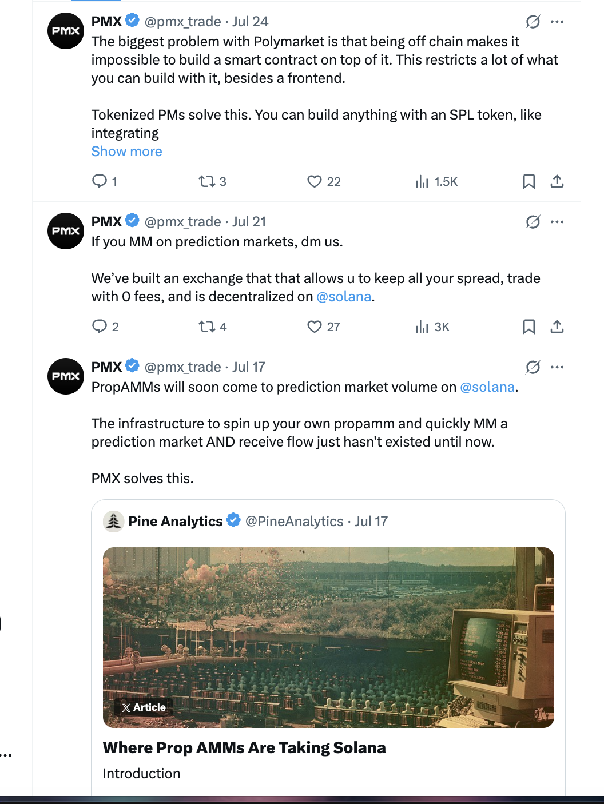
  - Jul 17 — "PropAMMs will soon come to prediction market volume on @solana. The
    infrastructure … just hasn't existed until now. **PMX solves this.**" QT of a
    [@PineAnalytics](https://x.com/PineAnalytics) X Article ("Where Prop AMMs Are
    Taking Solana") — 3 / 6 / 21 / **2.3K**.
    
  - Jul 24 — "The biggest problem with Polymarket is that being off chain makes it
    impossible to build a smart contract on top of it… Tokenized PMs solve this. You
    can build anything with an SPL token" — 1 / 3 / 22 / **1.5K**.
    
  - Jul 14 — "**PMX will payout more than Polymarket** in many different types of
    markets. Market makers on Polymarket make the most … whenever markets are
    volatile. No-one has brought this to retail MMs where anyone can profit off of
    the volatility" — 2 / 3 / 25 / **1.7K**.
    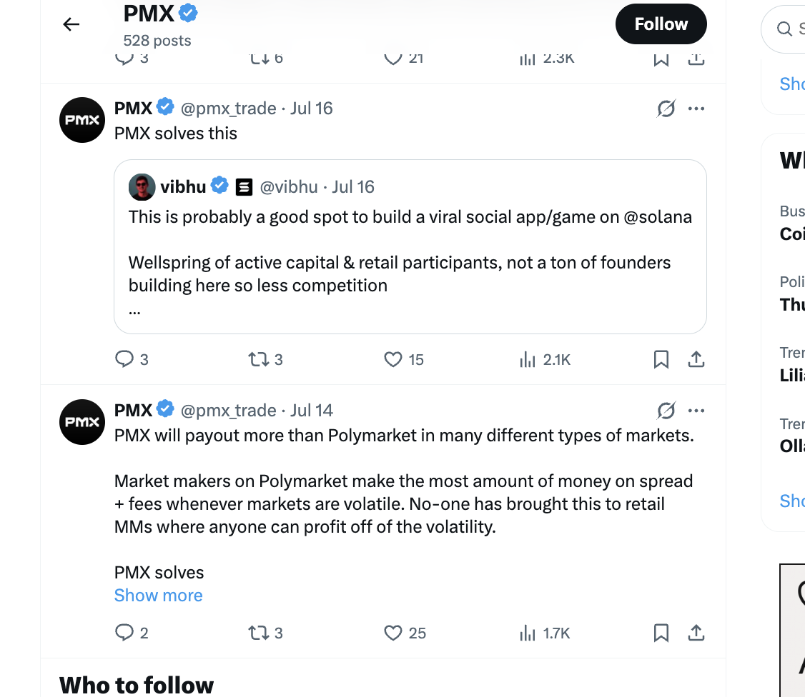
  - Jul 16 — "**PMX solves this**" QT of [@vibhu](https://x.com/vibhu) ("probably a
    good spot to build a viral social app/game on @solana… less competition") —
    3 / 3 / 15 / **2.1K**. 
- **The number that matters:** 14.6K followers producing **1.5K–3K views per post** —
  **~10–20% of the follower count**, versus Aeon's 1.4–5% at 150K. Ten times fewer
  followers, comparable absolute views. Small and engaged beats large and passive.
- **What we'd borrow:** (1) the **"we solve this" QT** — a one-line reply to someone
  else's stated problem is the cheapest repeatable post in the whole audit and it
  travels on the original poster's audience; (2) **the direct ask as a post** ("if you
  MM on prediction markets, dm us") — a small account can convert attention straight
  into conversations. Honesty guardrail: PMX asserts "solves this" with **no evidence
  attached**, which is exactly the move `claim-evidence-linter` exists to block. We
  can run the shape, but our version carries the number.

---

## §3 — What we'd borrow (ranked, mapped to our formats)

Our three community formats: **shiplog** (what we shipped), **tweet digest**, and
**feature-built** (one ship, deep). Each pattern below maps to one, or is flagged as
a **new X format** for when we get there.

1. **Real P/L receipts + "here's exactly how" roadmap** *(Roan)* — a real number/
   screenshot is the hook; the deep "how" is the payload. **This is our data-drop
   moat with a better wrapper**, and it's the highest-signal pattern in the audit.
   → **feature-built** (one strategy, real receipts) and **shiplog** (weekly real
   results). Roan's 3.1M-view pin is the proof.

2. **News-desk reframe** *(Polymarket, Kalshi)* — "JUST IN: [real event]" tied to a
   market/number, plain English. Highest reach-per-effort; it's the repeatable
   version of our best past post. → **tweet digest**, and a strong **new X format**.

3. **Long-form "framework / build" funnel with a curiosity hook** *(Roan, Movez,
   Lunar)* — a deep "here's the entire system" piece, teased with a hook. → **feature-
   built deep-dive**.

4. **One repeatable, recognizable shape every time** *(Rekt Capital)* — same format
   weekly until it's a brand and a habit. → **shiplog**.

5. **Chart-as-the-artifact** *(Kalshi, Rekt Capital)* — every claim rides a chart that
   travels on its own. → cross-format; strengthens **feature-built** and **shiplog**.

6. **Authority-figure opening line** *(Movez, Lunar: "Andrew Ng:", "Anthropic
   engineer:")* — borrow a credible name's quote as line one. **Honesty guardrail:
   never misattribute or inflate** — this is the pattern most in tension with our
   voice. → hook layer, any format.

7. **Plain-spoken "skin in the game" register** *(Kalshi)* — honest, no-hype, "real
   people, real money." → voice note for all three formats.

8. **QT-with-your-own-data flywheel** *(Bankr)* — amplify an ecosystem post and add a
   number only we can. → **tweet digest**.

9. **Recurring competition + public leaderboard** *(functionSPACE, Polymarket Combo
   Cup)* — a shareable standings graphic on a cycle. → engagement lever / promo;
   lower priority for a content feed.

*Added in round two:*

10. **"We solve this" QT** *(PMX)* — quote-tweet someone else's stated problem and
    answer in one line. The cheapest repeatable post in the audit, and it rides the
    original poster's audience. A sharper, opinionated cousin of #8. → **tweet
    digest**, and the highest-frequency **new X format** available to us on day one.
    **Our version must carry the evidence PMX's doesn't** (`claim-evidence-linter`).

11. **Model/news ride-along** *(Aeon: "Claude Opus 5 is now live on aeon")* — when
    something big launches, post that it works in our product *today*. News-reframe
    and promo in one, timely, and cheap. → **shiplog** and **tweet digest**.

12. **Article card that carries its own abstract** *(Aeon: "AN AGENT THAT SCANS
    ITSELF")* — the image holds the argument; the tweet is just a pointer. A cheaper
    cousin of #5 when the artifact is prose rather than a chart. → **feature-built**.

13. **The direct ask as a post** *(PMX: "If you MM on prediction markets, dm us")* —
    a small account can convert attention into conversations directly. → occasional
    lever, not a pillar.

**Three cautions from the data:**
- Small accounts posting **product-only** into a small following cap out fast
  (functionSPACE: tens of likes). Value first, promo ~4:1 — the worth-posting gate
  still holds.
- **A pure ship feed does not carry itself, at any size.** Aeon has 150.1K followers
  and lands 2.1K–7.4K views (1.4–5% of following); PMX has 14.6K and lands 1.5K–3K
  (10–20%). Followers are not reach. This is the single most important finding for
  the **shiplog**: "here's what shipped" needs a reason to be read — the receipts
  layer (#1) — or it flatlines exactly the way Aeon's does.
- The KOL "one banger carries the profile" dynamic (Movez 2.2M vs. typical single-
  digit-K) means **volume + a few real hits**, not every post landing. Don't read one
  viral post as a repeatable baseline.

---

## §4 — Gaps / round three

- ~~**Capture the two seeds Adrian named:** Aeon and pmxt.~~ **Done 2026-07-28** —
  both are in §1 and §2. Aeon resolved to `@aeonframework` (X) rather than
  `@aeon_agent` (its Telegram feed); "pmxt" resolved to PMX `@pmx_trade`.
- **Aeon's Telegram Agent Feed itself is still uncaptured.** The three community
  formats were borrowed from the *TG* feed, and what we now have is its *X* account —
  a different feed with a different shape. If the shiplog/tweet-digest/feature-built
  contracts are going to cite a source, the TG group is the one to screenshot.
- **KOL pool depth:** we deep-covered 4 of the KOL outreach pool (Roan, Movez, Lunar,
  + Rekt Capital as a category exemplar). The rest of the pool is in
  [`kol-outreach-pool.md`](kol-outreach-pool.md) — pull the next strongest posters.
- **Trading-bot builders** are thin here (Bankr only). Worth 1–2 more.
- Numbers are a 2026-07-24 snapshot (2026-07-28 for Aeon and PMX); re-capture if we
  cite them externally.
